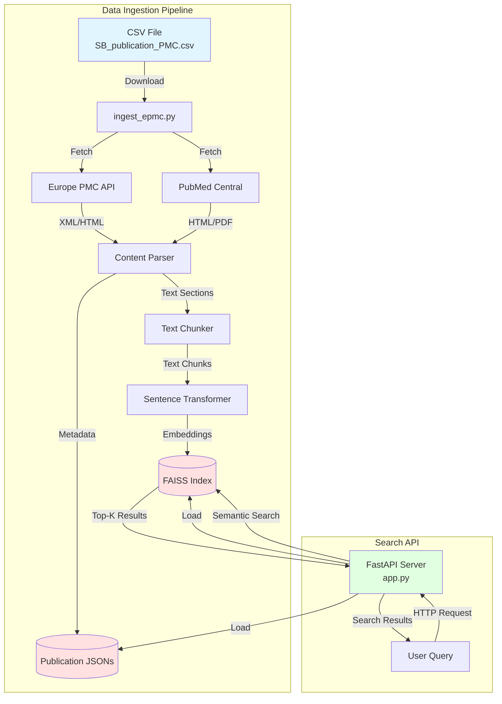
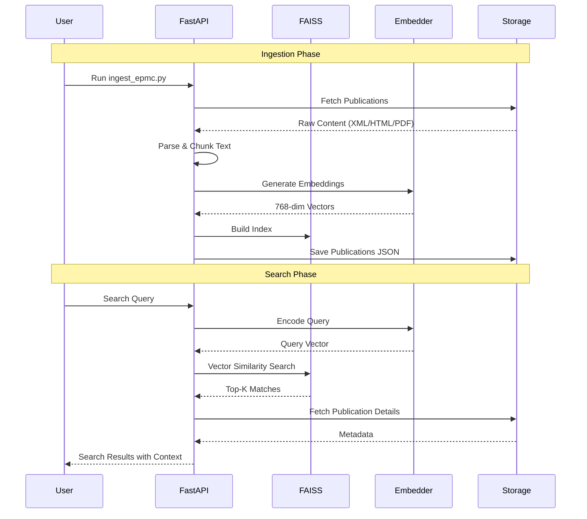
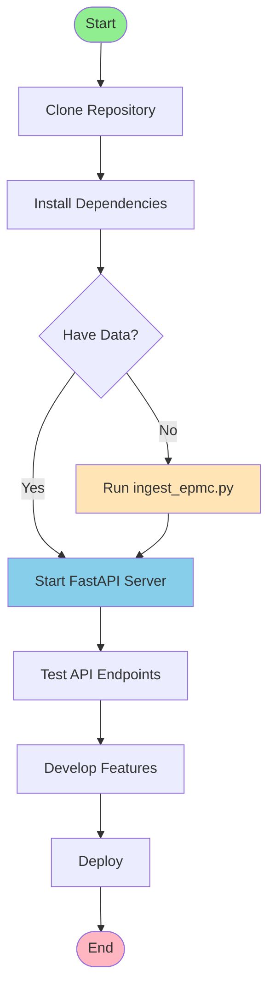

# SpaceBio Semantic Search

A semantic search engine for space biology research publications using AI-powered embeddings and vector similarity search.

## 🚀 Overview

This project provides a complete pipeline for ingesting, processing, and semantically searching scientific publications related to space biology. It downloads publications from PubMed Central (PMC), extracts their content, generates semantic embeddings, and provides a FastAPI-based search interface.

## 📊 System Architecture



## 🔄 Data Flow



## 🏗️ Project Structure

```
Space-APPS.Hackathon/
├── app.py                  # FastAPI server for semantic search
├── ingest_epmc.py          # Data ingestion pipeline
├── requirements.txt        # Python dependencies
└── data/
    ├── chunks_meta.json    # Metadata for each text chunk
    ├── embeddings.npy      # Numpy array of embeddings (929 × 768)
    ├── faiss_index.idx     # FAISS vector index
    ├── index_info.json     # Index statistics
    ├── publications/       # Individual publication JSON files
    ├── raw_html/          # Raw HTML/XML from sources
    └── raw_pdfs/          # Downloaded PDF files
```

## 📈 System Components

```mermaid
graph LR
    subgraph "Core Components"
        A[Text Chunker] --> |1200 chars<br/>250 overlap| B[Embeddings Generator]
        B --> |all-mpnet-base-v2| C[FAISS Index]
        C --> |L2 Distance| D[Search Engine]
    end
    
    subgraph "Data Sources"
        E[Europe PMC API] --> F[Content Aggregator]
        G[PubMed Central] --> F
        H[PDF Parser<br/>PyMuPDF] --> F
    end
    
    subgraph "API Endpoints"
        D --> I[/health]
        D --> J[/search?q=...&k=5]
        D --> K[/pub/PMC_ID]
    end
    
    F --> A
    
    style B fill:#ffeb99
    style C fill:#99ccff
    style D fill:#99ff99
```

## 🛠️ Installation

### Prerequisites

- Python 3.8+
- pip

### Setup

1. Clone the repository:
```bash
git clone https://github.com/Ultra-Cube/Space-APPS.Hackathon.git
cd Space-APPS.Hackathon
```

2. Create a virtual environment (recommended):
```bash
python -m venv venv
source venv/bin/activate  # On Windows: venv\Scripts\activate
```

3. Install dependencies:
```bash
pip install -r requirements.txt
```

## 📥 Data Ingestion

To populate the database with publications:

```bash
python ingest_epmc.py
```

**What it does:**
- Downloads publication metadata from GitHub CSV source
- Fetches full-text content from Europe PMC and PubMed Central
- Extracts structured sections (Abstract, Methods, Results, etc.)
- Splits text into overlapping chunks (1200 chars with 250 char overlap)
- Generates semantic embeddings using `all-mpnet-base-v2` model
- Builds a FAISS index for fast similarity search
- Saves everything to the `data/` directory

**Configuration:**
- Edit `ingest_epmc.py` to adjust `limit=10` to process more publications
- Default processes 10 publications for quick testing
- Set `limit=None` to process all publications

## 🚀 Running the API

Start the FastAPI server:

```bash
uvicorn app:app --reload --host 0.0.0.0 --port 8000
```

The API will be available at `http://localhost:8000`

### Interactive API Documentation

- Swagger UI: `http://localhost:8000/docs`
- ReDoc: `http://localhost:8000/redoc`

## 🔍 API Endpoints

### Health Check
```http
GET /health
```

**Response:**
```json
{
  "status": "ok",
  "n_chunks": 929
}
```

### Semantic Search
```http
GET /search?q=bone%20loss%20microgravity&k=5
```

**Parameters:**
- `q` (required): Search query string
- `k` (optional): Number of results to return (1-50, default: 5)

**Response:**
```json
[
  {
    "score": 45.2,
    "pub_id": "PMC3630201",
    "section": "abstract",
    "excerpt": "Microgravity induces pelvic bone loss...",
    "pub_title": "Microgravity induces pelvic bone loss...",
    "pub_year": "2013",
    "pub_authors": "John Doe, Jane Smith"
  }
]
```

### Get Publication
```http
GET /pub/PMC3630201
```

**Response:** Complete publication JSON with all sections and metadata.

## 🧪 Example Queries

```bash
# Search for bone loss research
curl "http://localhost:8000/search?q=bone%20loss%20in%20space&k=5"

# Search for radiation effects
curl "http://localhost:8000/search?q=radiation%20exposure%20astronauts&k=10"

# Get specific publication
curl "http://localhost:8000/pub/PMC3630201"

# Health check
curl "http://localhost:8000/health"
```

## 📊 Technical Details

### Embedding Model
- **Model:** `sentence-transformers/all-mpnet-base-v2`
- **Dimensions:** 768
- **Quality:** High-quality general-purpose embeddings
- **Speed:** ~50 chunks/second on CPU

### Vector Index
- **Type:** FAISS IndexFlatL2 (exact search)
- **Distance Metric:** L2 (Euclidean distance)
- **Current Size:** 929 vectors × 768 dimensions
- **Search Speed:** Sub-millisecond for k=5

### Text Processing
- **Chunk Size:** 1200 characters
- **Overlap:** 250 characters
- **Purpose:** Balance between context and granularity

## 🧩 Dependencies

### Core Libraries
- **FastAPI** (0.95+): Modern web framework for APIs
- **Sentence Transformers** (2.2.2+): Generate semantic embeddings
- **FAISS** (1.7.4): Fast similarity search and clustering
- **Uvicorn** (0.22+): ASGI server

### Data Processing
- **Pandas** (2.0+): Data manipulation
- **BeautifulSoup4** (4.12+): HTML/XML parsing
- **PyMuPDF** (1.22.3+): PDF text extraction
- **Requests** (2.28+): HTTP library

See `requirements.txt` for complete list.

## 🔧 Development

### Project Workflow



### Customization

**To change the embedding model:**
1. Update `EMB_MODEL` in both `ingest_epmc.py` and `app.py`
2. Re-run ingestion to regenerate embeddings
3. Restart the API server

**To modify chunk size:**
1. Update `CHUNK_SIZE_CHARS` and `CHUNK_OVERLAP` in `ingest_epmc.py`
2. Re-run ingestion
3. Restart the API server

## 📝 Data Statistics

Current indexed data:
- **Publications:** 10 (sample dataset)
- **Text Chunks:** 929
- **Embedding Dimensions:** 768
- **Index Type:** Flat L2
- **Storage Size:** ~6 MB

## 🎯 Use Cases

1. **Researchers:** Find relevant space biology publications quickly
2. **Literature Review:** Discover related work on specific topics
3. **Data Mining:** Extract insights from large publication datasets
4. **Knowledge Discovery:** Identify connections between different research areas

## 🤝 Contributing

Contributions are welcome! Please feel free to submit a Pull Request.

## 📄 License

This project is part of the NASA Space Apps Hackathon initiative.

## 🌟 Acknowledgments

- **Data Source:** Space Biology publications from PubMed Central
- **APIs:** Europe PMC, PubMed Central
- **Models:** Sentence Transformers by UKPLab
- **Vector Search:** FAISS by Facebook Research

## 📧 Contact

For questions or feedback, please open an issue on GitHub.

---

**Built for NASA Space Apps Hackathon** 🚀🔬
